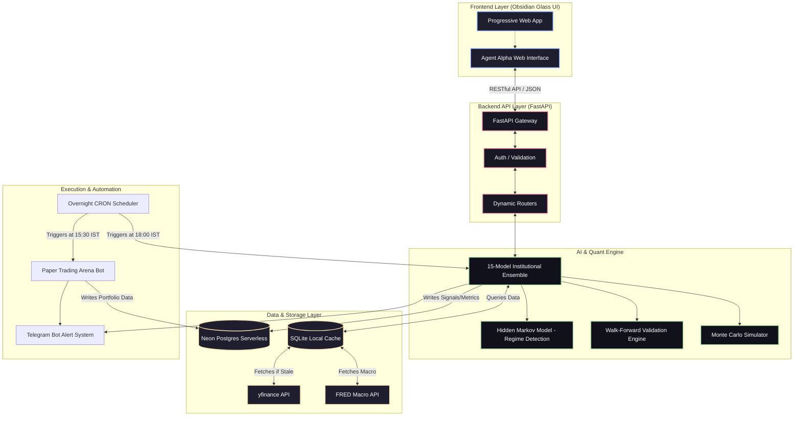
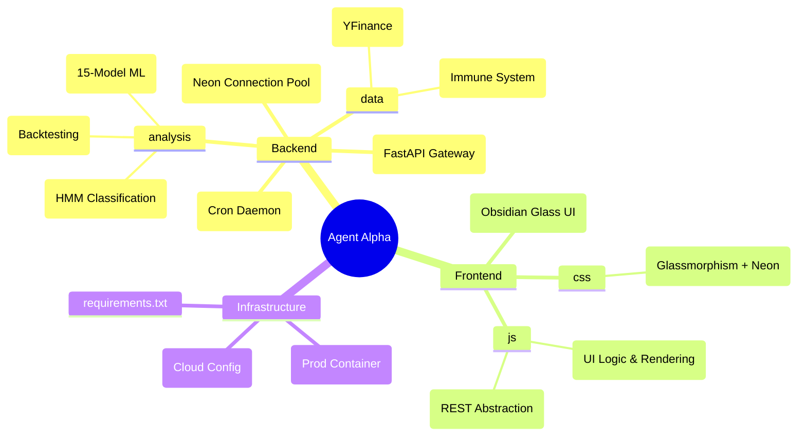

# 🧠 Agent Alpha — System Architecture

Agent Alpha is a highly distributed, institutional-grade algorithmic trading system. It operates on a multi-tier architecture designed for robustness, high-speed execution, and seamless deployment across cloud environments.

## 1. High-Level System Architecture



## 2. 15-Model Institutional Ensemble Logic

The core alpha-generation engine runs on a 15-Model Ensemble. It processes thousands of data points and vetoes signals using a strict Capital Preservation matrix.

```mermaid
flowchart LR
    A([Raw Market Data]) --> B{Data Validator}
    
    B -->|Stale/Null Data| REJECT[Reject & Log Warning]
    B -->|Fresh Data (Max 96h)| C(Feature Engineering)
    
    C --> D1[Technical Scoring]
    C --> D2[Momentum Scoring]
    C --> D3[Transformer AI Patterns]
    C --> D4[Macro & Regime Bias]
    
    D1 & D2 & D3 & D4 --> E(Aggregate Weighted Score)
    
    E --> F{HMM Regime Check}
    F -->|High Volatility Chop| VETO[Veto: Capital Preservation]
    F -->|Bull / Mean Reversion| G(Signal Generation)
    
    G --> H{MTF Alignment}
    H -->|Weekly Conflict| WEAK[Label: Weak / Watch]
    H -->|Weekly Alignment| STRONG[Label: Early Breakout / Dip Opportunity]
    
    STRONG --> I([Write to Database & Alert])
    
    style A fill:#f9e2af,color:#000
    style REJECT fill:#f38ba8,color:#000
    style VETO fill:#f38ba8,color:#000
    style STRONG fill:#a6e3a1,color:#000
    style I fill:#89b4fa,color:#000
```

## 3. Paper Trading Arena Pipeline

The Arena simulates a `₹1,000,000` (10 Lakh) starting portfolio, automatically executing the ML Engine's signals at market close.

```mermaid
sequenceDiagram
    participant CRON as Scheduler (15:30 IST)
    participant ML as ML Ensemble
    participant ARENA as Arena Engine
    participant DB as Postgres DB
    participant TG as Telegram Bot

    CRON->>ML: Run Daily Nifty 50 Scan
    ML->>ARENA: Pass High-Conviction Signals
    ARENA->>DB: Query Current Portfolio & Cash
    DB-->>ARENA: Cash: ₹10,00,000
    
    rect rgb(20, 30, 40)
        Note over ARENA: Position Sizing Logic (2% Risk Limit)
        ARENA->>ARENA: Calculate Stop Loss Distance
        ARENA->>ARENA: Calculate Required Margin
    end
    
    ARENA->>DB: Insert Paper Trades (OPEN)
    ARENA->>DB: Update Portfolio Equity Curve
    ARENA->>TG: Push "New Trade Executed" Alert to CEO
```



## 4. Obsidian Mindmap: Codebase Directory


