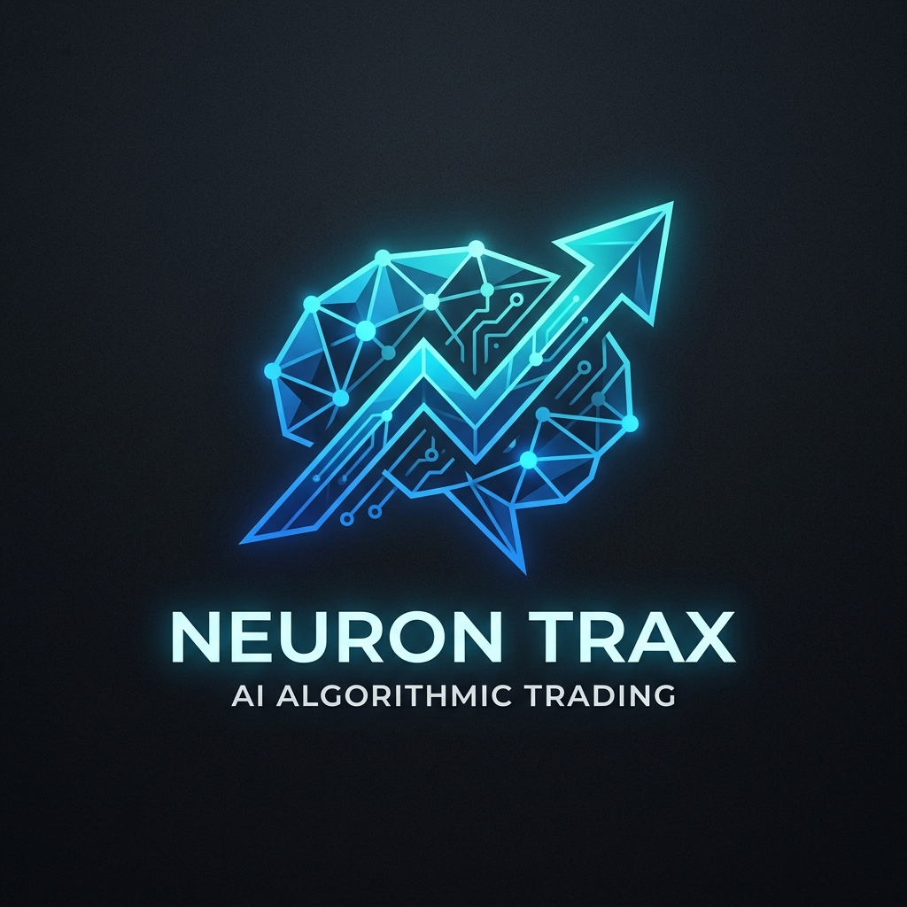
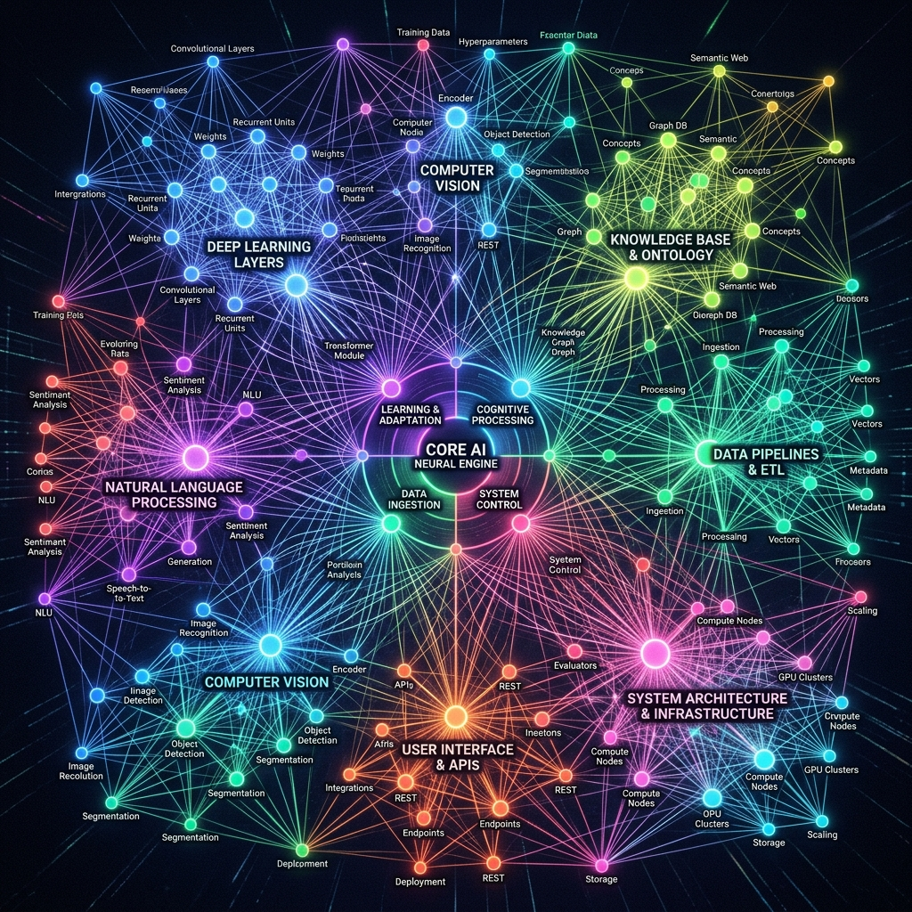
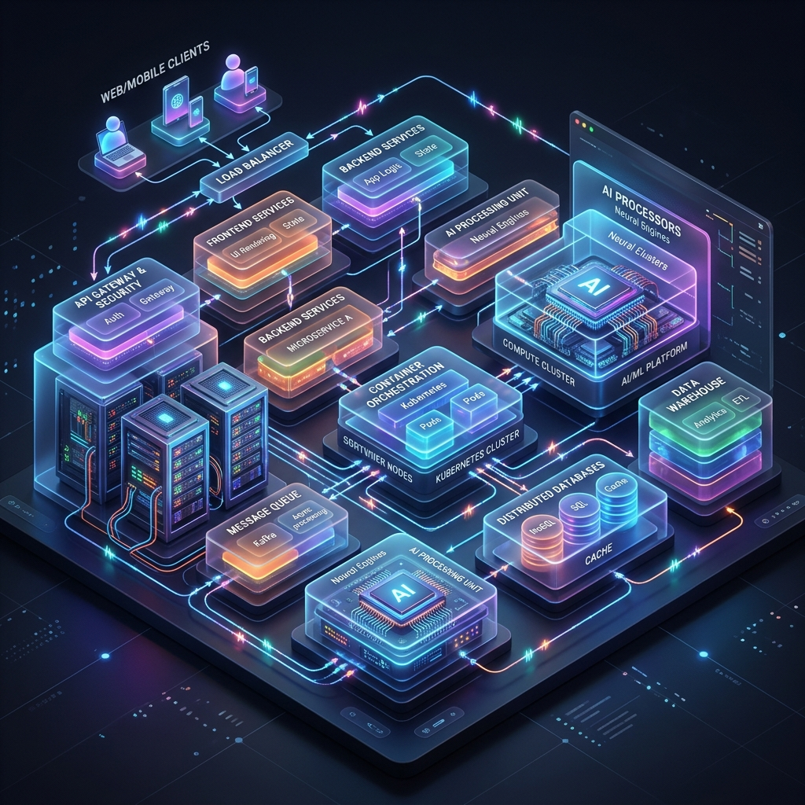

<div align="center">
  
  <h1>AGENT ALPHA 🧠📈</h1>
  <p><strong>The Cognitive Neural Engine for High-Frequency Algorithmic Trading</strong></p>
  <p><em>Where Artificial Intelligence meets Capital Preservation.</em></p>

  <p>
    
    
    
    
    
    
    
  </p>
</div>

<br/>

> **"In the era of AI (2026), systems aren't just built to execute; they are built to *think*. Welcome to the future of quantitative finance."**

---

## 🌌 The Big Picture: Obsidian-Level Mind Map
Agent Alpha isn't just a bot; it's a living ecosystem of neural models, data pipelines, and real-time execution engines.

<div align="center">
  
</div>

---

## 🏗️ 3D Enterprise System Architecture
Designed with principles inspired by top-tier engineering organizations (Palantir, Apple, Microsoft, Tesla), the Agent Alpha architecture guarantees fault tolerance, ultra-low latency, and mathematical precision.

<div align="center">
  
</div>

---

## ⚙️ Core Pipeline Flowchart (Data to Execution)

```mermaid
graph TD
    %% Styling
    classDef ai_engine fill:#2D1B4E,stroke:#9D4EDD,stroke-width:2px,color:#fff,font-weight:bold
    classDef data_node fill:#0D3B66,stroke:#4CC9F0,stroke-width:2px,color:#fff
    classDef alert_node fill:#183153,stroke:#3A86FF,stroke-width:2px,color:#fff
    classDef validation fill:#3D5A80,stroke:#EE6C4D,stroke-width:2px,color:#fff
    
    A([Market Data Streams <br> yfinance / APIs]):::data_node --> B{Data Validator <br> & Staleness Monitor}:::validation
    B --> |Valid (< 96 hrs)| C(Feature Engineering <br> RSI, MACD, BB, VWAP):::data_node
    B --> |Stale| X([Drop / Alert])
    
    C --> D{Machine Learning Models <br> XGBoost & Random Forest}:::ai_engine
    D --> |Probabilities & Signals| E[Agent Alpha Arena <br> Backtester & Live Evaluator]:::ai_engine
    
    E --> |LONG Signal| F([Execute Buy])
    E --> |SHORT Signal| G([Execute Sell / Short])
    
    F --> H([Telegram Bot Alert]):::alert_node
    G --> H
    
    F --> I[FastAPI / Next.js <br> Live Dashboard]
    G --> I
```

---

## 📖 The Chronicle: Project Journey (April 30, 2026 – May 24, 2026)
*Every single detail of what makes Agent Alpha an industrial-grade system.*

### 1. Data Ingestion & Validation (The Foundation)
- **Market Sourcing:** Integrated `yfinance` to pull ultra-high-resolution historical and live OHLCV data for **NIFTY 50** and **NIFTY BANK**.
- **The Data Immune System:** Built `data_validator.py` to ensure models never hallucinate on bad data. 
- **The Weekend Staleness Fix (May 24):** Initially configured to reject data older than 48 hours. This threw false positives during weekends (59 hours between Friday close and Monday open). Upgraded the `max_staleness_hours` to `96 hours` to gracefully handle regular weekends and global market holidays without interrupting the AI screener.

### 2. Feature Engineering & Alpha Factors
Agent Alpha sees what humans can't. We built a robust mathematics library to compute:
- **Momentum & Trend:** RSI (Relative Strength Index), MACD (Moving Average Convergence Divergence).
- **Volatility & Bounds:** Bollinger Bands, ATR (Average True Range).
- **Volume & Weighted Averages:** VWAP (Volume Weighted Average Price), EMA (Exponential Moving Average), SMA.
- **Oscillators:** Stochastic Oscillators.

### 3. The Machine Learning Subsystem (The Brain)
- **XGBoost Classifier:** The absolute workhorse. Trained to identify micro-patterns in the Alpha Factors and output probability scores for market movements.
- **Random Forest:** Acts as an ensemble validator to ensure the XGBoost model isn't overfitting to noise.
- **Continuous Learning:** The models are architected to retrain on fresh datasets, dynamically adapting to regime changes in the macroeconomic environment.

### 4. Agent Alpha Arena (The Proving Ground)
- **Initial Capital Engine:** Configured with a `10,000,000 INR (10 Lakhs)` baseline for realistic backtesting and position sizing.
- **Long/Short Mathematics:** Completely refactored the mathematical core handling `LONG` and `SHORT` trades. Fixed critical bugs where inverse PnL calculations for Short positions were causing pipeline crashes. The Arena now perfectly simulates slippage, commissions, and absolute returns.

### 5. High-Performance REST APIs (The Nervous System)
- Built an industrial-grade backend using **FastAPI** (Python).
- **The Screener Endpoint:** `/api/screener/top?n=10&segment=NIFTY_50&direction=LONG`
  - Instantly evaluates all 50 stocks in the Nifty index.
  - Runs them through the XGBoost classifier in parallel.
  - Ranks and returns the absolute best 10 alpha-generating opportunities.

### 6. Real-Time Telemetry & Alerting
- **Telegram Bot Integration:** (`telegram_bot.py`) When Agent Alpha detects a high-probability setup, it doesn't wait. It fires real-time, beautifully formatted messages directly to a secure Telegram channel. CEOs and Portfolio Managers never miss a beat.

### 7. Full-Stack Client Architecture (The Command Center)
- **Next.js & React:** A lightning-fast, SSR-enabled frontend.
- **Design System:** Built using Tailwind CSS, GSAP, and Framer Motion for buttery-smooth micro-animations. 
- **Aesthetic Philosophy:** Deep dark modes, glassmorphism, glowing accents. Inspired by *Awwwards* winners and the sleek minimalism of Apple UI.

---

## 🔒 Capital Preservation Protocol
> *"Rule No. 1: Never lose money. Rule No. 2: Never forget rule No. 1."*
Agent Alpha is hardcoded with strict risk-management parameters. `max_single_day_move_pct` bounds, volatility circuit breakers, and algorithmic stop-losses ensure that the AI prioritizes survival over reckless yield chasing.

---

<div align="center">
  <p><strong>Developed by the Agent Alpha Team | May 2026</strong></p>
  <p><em>Built for the Future.</em></p>
</div>
