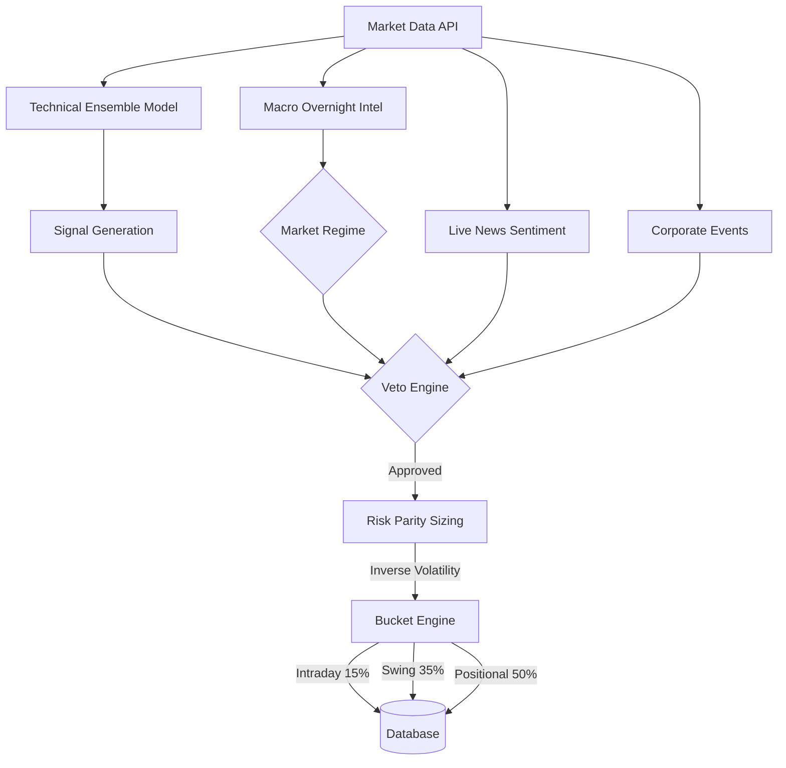

# Market Analyser - Agent Alpha v2.0

An autonomous, multi-timeframe quantitative trading engine designed to systematically trade the NIFTY 50 index. Agent Alpha combines technical ensemble modeling, macroeconomic analysis, live news sentiment, and corporate event tracking into a unified risk parity framework.

## 🚀 Architecture Overview

Agent Alpha operates entirely autonomously using two scheduled cron tasks:
1. **08:30 AM (Overnight Intel):** Scans macro indicators (Fed Watch, VIX, Geopolitics) to set the daily portfolio regime.
2. **03:00 PM (Daily Arena):** Evaluates all NIFTY 50 stocks for entry using a highly structured funnel.



## ⚙️ Core Engines

### 1. Market Regime & Macro Intelligence
Analyzes Global Liquidity, China PMI, Geopolitical Risk, and VIX to classify the market into regimes (e.g., `high_vol_uptrend`, `low_vol_chop`). This dynamically adjusts the aggression and risk parameters of the entire portfolio.

### 2. Multi-Timeframe Bucket Engine
Capital is split into three strict time horizons:
- **Intraday (15%)**: 0-1 day holding period.
- **Swing (35%)**: 2-10 days holding period.
- **Positional (50%)**: 11-45 days holding period.
If a bucket fills up, no more trades of that type are permitted.

### 3. Risk Parity Sizing
Calculates a **Volatility Scalar** based on a stock's annualized variance compared to the NIFTY baseline. Highly volatile stocks (like Adani) are allocated 50% less capital than stable stocks (like HDFC) to ensure equal portfolio impact. Caps sector concentration at **30%** of total capital.

### 4. Veto Engine (The Iron Shield)
Before execution, a trade must survive four layers of defense:
- **News Sentiment:** Vetoes trades with `BREAKING_NEGATIVE` NLP sentiment.
- **Corporate Events:** Vetoes trades 3 days before an earnings report.
- **Portfolio Correlation:** Vetoes trades highly correlated (>0.65) to existing positions.
- **Regime Rejection:** Vetoes aggressive trades during choppy/bearish macro regimes.

---

## 🛠️ Installation & Deployment

Agent Alpha is fully containerized with Docker, meaning it can run 24/7 on any cloud VPS (AWS, DigitalOcean, etc.) or locally on your Mac.

### Prerequisites
- Docker and Docker Compose installed.
- (Optional) `TELEGRAM_BOT_TOKEN` for notifications.

### Running with Docker

1. **Clone the repository:**
   ```bash
   git clone https://github.com/yourusername/market-analyser.git
   cd market-analyser
   ```

2. **Start the Engine in Detached Mode:**
   ```bash
   docker-compose up -d --build
   ```

3. **Check the Logs:**
   Ensure the scheduler has started successfully:
   ```bash
   docker logs -f agent_alpha_bot
   ```

### Running Locally (Without Docker)

1. Create a virtual environment and install dependencies:
   ```bash
   python3 -m venv venv
   source venv/bin/activate
   pip install -r requirements.txt
   ```

2. Run the main scheduler:
   ```bash
   PYTHONPATH=backend python3 backend/main.py
   ```

## 🗄️ Database Management
The system uses SQLite (stored in `backend/data/agent_alpha.db`). 
- **Docker Persistence:** The database folder is mapped via Docker volumes, so your portfolio history persists even if the container restarts.
- **Automated Backups:** Before the 3:00 PM Arena execution, the system automatically creates an `agent_alpha_backup.db` and runs a `VACUUM` cleanup.

## 🛑 Operations Runbook
- **Stop the bot:** `docker-compose down`
- **Manual Override (Sell All):** *Future feature, but currently you can manually execute `DELETE FROM paper_trades` if you wish to reset the environment.*
- **Changing Tickers:** Edit `NIFTY_50_SYMBOLS` in `backend/config.py`.
