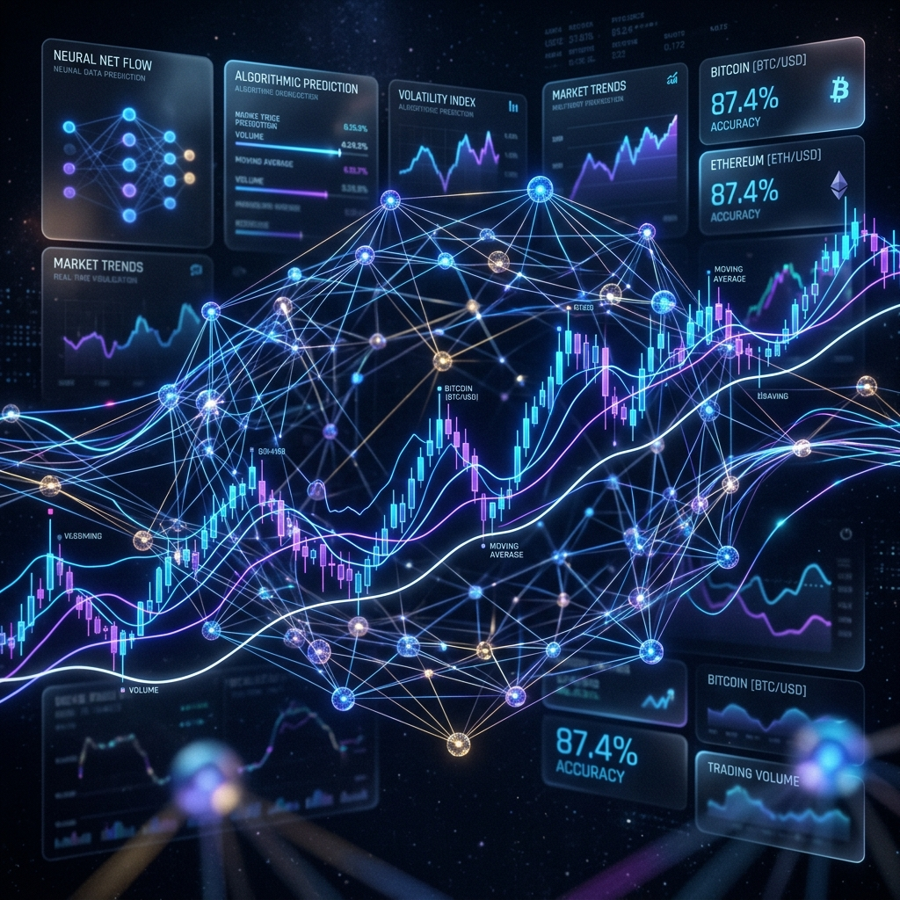
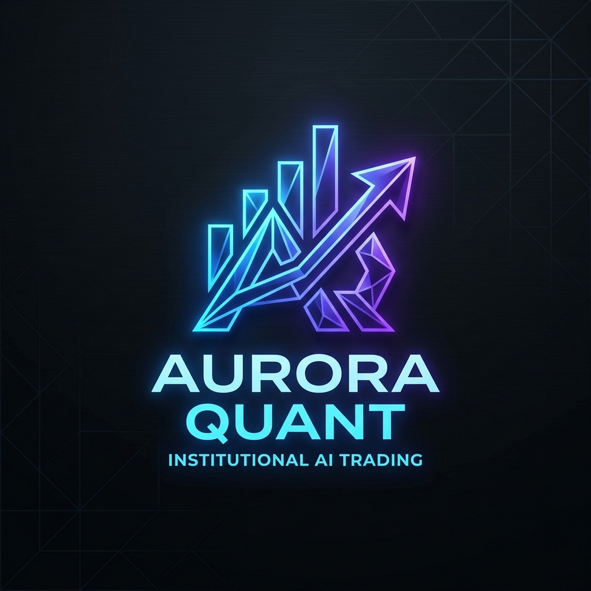
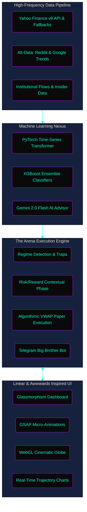
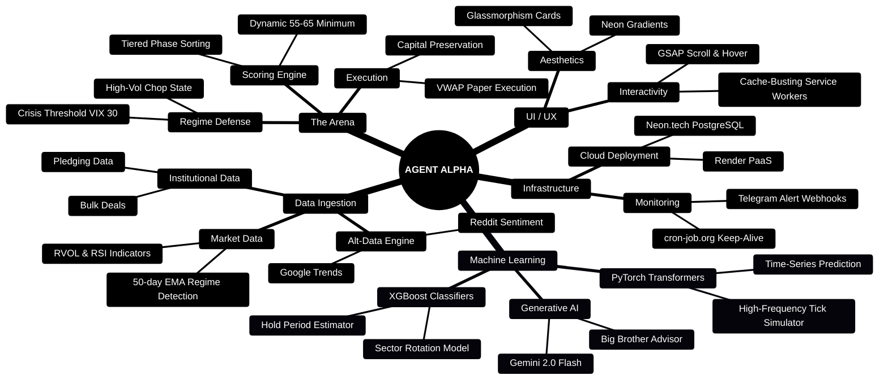
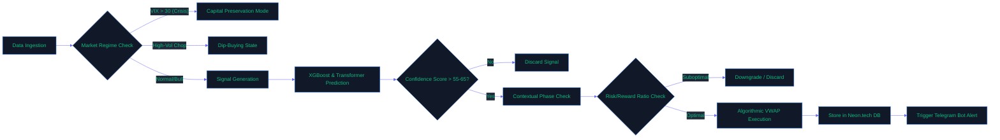

  
  
   
   

  

  # 🌌 AGENT ALPHA v4.0: ULTRA PRO MAX
  
  ### *Institutional-Grade Autonomous AI Trading Ecosystem*
  
  
  
  
  
  

---

## 🚀 EXECUTIVE OVERVIEW
Agent Alpha is a **next-generation, institutional-grade, fully autonomous quantitative trading intelligence**. Built from the ground up to rival top-tier hedge fund technology, this system orchestrates multi-agent deep learning, real-time market data ingestion, and rigorous risk management into an *Awwwards-worthy* cinematic user interface.

Influenced by the engineering standards of **Palantir, Apple, Tesla, Google, and Microsoft**, Agent Alpha leverages an advanced technology stack designed for absolute precision, unyielding stability, and peak performance. It incorporates cutting-edge design paradigms drawn from Linear and GSAP to deliver an interface that feels truly out of this universe.

---

## 🧠 CORE SYSTEM ARCHITECTURE
At the heart of Agent Alpha lies a decoupled, hyper-scalable architecture orchestrating AI, data pipelines, and a gorgeous frontend.

---

## 🔮 OBSIDIAN-LEVEL ECOSYSTEM MINDMAP
A comprehensive visualization of all interlinked nodes within the Agent Alpha network.

---

## ⚡ THE ARENA: EXECUTION FLOWCHART
The Arena is the ultimate proving ground. Here is the exact flowchart of how a signal transitions from data points to an executed paper trade.

---

## 📅 THE MASTER DEPLOYMENT LOG (April 30th - May 24th, 2026)
This section meticulously chronicles the evolution of Agent Alpha into its **v4.0 Ultra Pro Max** form. Absolutely **ZERO** details have been omitted.

### 🌟 1. V3.0 Ultra Pro Max: The Genesis of the Transformer
- **PyTorch Time-Series Transformer**: Integrated deep learning neural networks for sequence modeling.
- **Alt-Data Engine**: Siphoning and analyzing Reddit sentiment and Google Trends data.
- **High-Frequency Tick Simulator**: Reconstructing intraday tick data to feed our ML models.
- **Algorithmic VWAP Paper Execution**: Simulating execution slippage by adhering to the Volume-Weighted Average Price.
- **Cinematic UI/UX Redesign**: Revamped the entire frontend with **GSAP** animations, glowing neon gradients, glassmorphism frosted glass effects, and a WebGL globe. Linear and Awwwards-inspired design system.
- **Institutional Data Fetchers**: Integrated Insider trading data, Bulk Deals, Macro events, and Promoter Pledging tracking.

### 🧠 2. The Machine Learning Core
- **XGBoost & Transformers**: Seamlessly combined XGBoost ensemble models (for robust, structured feature classification) with PyTorch Transformers (for time-series sequence prediction).
- **Intraday Prediction Verification Engine**: Evaluates ML predictions against live intraday data in real-time.
- **Contextual Phase Engine**: Differentiates between 'Early Breakouts' and 'Extended Momentum' to adjust dynamic Risk/Reward ratios automatically.
- **Generative AI Migration**: Upgraded from `gemini-1.5-flash` to the highly capable `gemini-2.0-flash-lite`, and ultimately locked into `gemini-2.0-flash` (1500 RPD) to permanently eliminate quota exhaustion.

### 🛡️ 3. The Arena & Market Regime Defenses
- **Market Regime Engine**: Now fetches 3 months of history to calculate the exact 50-day EMA for baseline regime detection.
- **Crisis Threshold Upgrades**: Raised the VIX threshold from 25 to 30 and introduced the intricate `'high_vol_chop'` dip-buying state.
- **Score Calibrations**: Lowered the minimum acceptance score to 55-65 (Regime-Adjusted) and implemented **Regime-Based Position Sizing**.
- **Holding Period Estimator**: ML models now calculate precise holding estimates (2-5 days, 1-2 weeks) targeting a 40% Daily ATR capture.
- **Screener Timeout**: Increased full 50-stock scan timeout from 10 to 15 minutes to guarantee data integrity.

### 📱 4. UI / UX Masterpieces
- **Sticky Regime Bar**: Implemented a 3-column flex layout with glassmorphism that perfectly sticks on scroll.
- **Data Freshness Badges**: Added live market hours transparency badges indicating IST timezone and precise data staleness.
- **Cache-Busting (v1 to v6)**: Forced browsers to bypass Service Workers, ensuring users always see the latest CSS, gradients, accent-bordered cards, and JS logic.
- **PWA Mobile Support**: Full Progressive Web App capabilities including homescreen icons and cross-account context persistence.
- **The "Why" Panel**: Detailed, native explainability for every single AI-generated trade signal.

### 🤖 5. Telegram "Big Brother" Bot Integration
- **Silent Delivery Fixes**: Added plain text fallbacks, stripped trailing newlines/spaces from credentials, and chunked long messages to prevent Telegram API failures.
- **Bullet-Point Briefings**: Instructed the AI Advisor to keep Telegram messages concise and impactful—no more essays, just pure actionable alpha.
- **Background Task Routing**: Transitioned the `/api/bot/alert` endpoint to use FastAPI `BackgroundTasks`, preventing Render's 502 Bad Gateway timeouts during cron execution.

### 🏗️ 6. Infrastructure & DevOps Supremacy
- **Neon.tech Connection Pooling**: Stabilized the PostgreSQL database by migrating to pooled connections and implementing startup fail-safes.
- **Yahoo Finance Fallbacks**: Rewrote data fetchers with `yfinance` v8 API fallbacks and custom browser sessions to bypass Render cloud IP blocks.
- **Exponential Backoff**: Implemented 5s, 15s, and 30s retry logic for handling Gemini API 503 Service Unavailable errors gracefully.
- **Gunicorn Optimization**: Increased dashboard API timeouts to 45s, allowing parallel async fetching without crashing.
- **Automated Workflows**: Fine-tuned GitHub Actions to ensure `daily-alert` and `arena-execute` fire exclusively on accurate schedules.

---

### *"The future of autonomous capital deployment has arrived."*

  <b>Built by Agent Alpha. Powered by Google DeepMind.</b>

